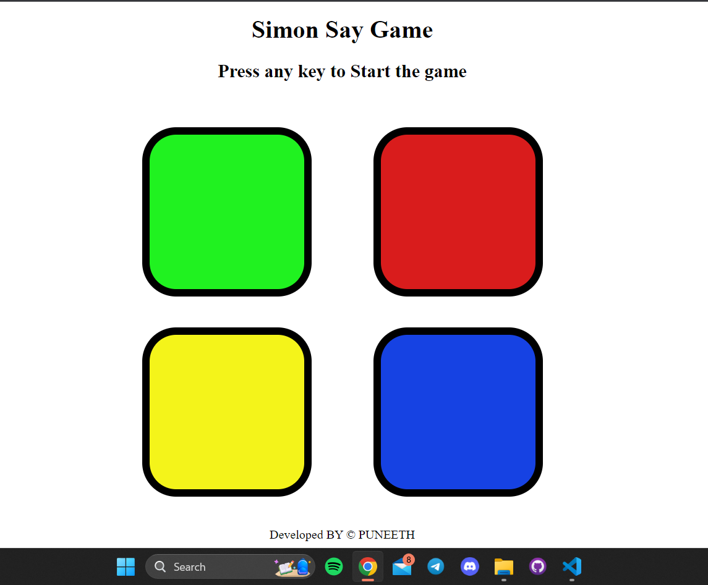

# Simon Says Game

Welcome to the Simon Says Game repository! This classic memory and pattern recognition game is developed using HTML, CSS, and JavaScript.

## How to Play

1. **Start the Game**: Click the Any key to  to initiate the game.

2. **Watch the Pattern**: Simon will produce a series of colored lights and sounds. Pay close attention to the sequence.

3. **Repeat the Pattern**: After Simon's turn, it's your turn! Repeat the pattern by clicking the color buttons in the same order. Be careful, the sequences get longer and more challenging as you progress.

4. **Winning**: Keep replicating the pattern correctly to advance. The game ends when you make a mistake.
